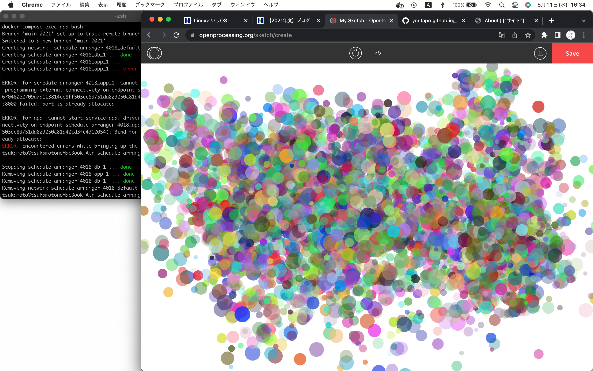

#  About
簡単な自己紹介やアピール。
どんなことができる、したいのか。

##  Profile
- 名前（ハンドルネームも可）
- 所在地（県や市まででOK）
- 得意領域（Web開発、サーバー運用など）
#  Skills

使ったことや興味のある言語、ツール、OSなどを具体的に書きましょう。
- OS（Windows,Ubuntuなど）
- Languages（JavaScriptなど）
- Engine,Frameworks (Node.js, Expressなど)
- Tool,MiddleWare（Git, PostgreSQLなど）
- 資格、免許（情報処理技術者、LPICなど）

#  Works
アピールできる活動内容を書きましょう。
- [GitHub](GitHubのURL)
- [Qiita](QiitaのURL)
- 作った作品
  - [作品1](作品1のURL)
  - [作品2](作品2のURL)

#  Contact
連絡先を書きましょう。
- [Twitter](TwitterプロフィールのURL)
- [LinkedIn](LinkedInプロフィールのURL)
- [Mail](mailto:メールアドレス)

#  History
学歴、職歴、アルバイト、インターン経験など。
- 2019年 [株式会社ドワンゴ](URL) 入社
- 2018年 角川ドワンゴ学園 [N高等学校](URL) 卒業
- 表彰、受賞歴、メディア掲載記事などあれば
